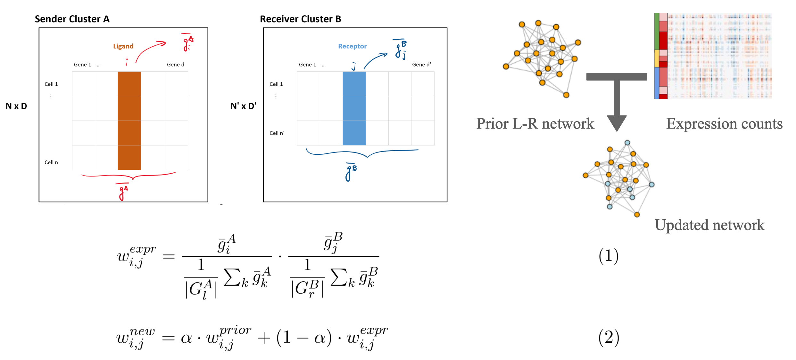

## BMEN 4480 Final Project (Fall 2020)

### Overview

We applied [NicheNet](https://github.com/saeyslab/nichenetr/) to infer intercellular Ligand-Receptor (L-R) interactions from scRNA-seq data. In particular, we investigated the mutual interactions between cancer stem cells (CSCs) and tumor associated macrophages (TAMs) retrieved from the following [dataset](https://www.ncbi.nlm.nih.gov/geo/query/acc.cgi?acc=GSE89567) via NicheNet. We also modified the L-R interaction weights by combining NicheNet's prior network scores and our updated scores from the dataset-specific expression values.
<br><br>

<br><br>

### Prerequisites
Python: Numpy, Pandas, Scanpy <br>
R: nichenetr <br>

Installation of NicheNet from their github page:
> Installation typically takes a few minutes, depending on the number of
dependencies that has already been installed on your pc. You can install
nichenetr (and required dependencies) from github with:
> ```
> install.packages("devtools")
> devtools::install_github("saeyslab/nichenetr")
> ```
> nichenetr was tested on both Windows and Linux (most recently tested R
version: R 4.0.0)

### Files & Directories
Scripts
* ```preprocessing.ipynb``` Preprocessing, data cleaning, clustering, identification of expressed genes & marker genes for each cluster
* ```weight_calculatioo.ipypb``` Update the edge scores of the L-R prior network from NicheNet with expression values (see the concept figure)
* ```rl_utils.R``` Utility & visualization functions for ligand receptor interaction inference
* ```rl_predictions.Rmd``` L-R inference with NicheNet's prior network
* ```rl_predictions_weighted.Rmd``` L-R inference with our updated network 
* ```visualize.Rmd``` Visualization of top L-R interactions
* ```Brain.R``` Differential analysis & gene ontology, pathway analysis


Directories
* dataset: Original & preprocessed count matrices
* supplementary_materials: supplementary table for final report
* plots: Output plots with NicheNet's prior network
* plots_weighted: Output plots with our updated network
* top_rl_pairs: Top inferreed L-R pairs with NicheNet's prior network
* top_rl_pairs_weighted: Top inferred L-R pairs with our updated network
